# Pixel's Arcade

Pixel's Arcade is a collection of single-player JavaScript games designed to be played in browser on desktop or mobile devices.

Currently available games include:
- Slap-a-Rabbit
- Rock, Paper, Scissors
- Dead Heads Memory Game
- Space Invaders

The site is targeted towards users who are searching for quick, accessible games to pass the time on their PC or mobile phone.

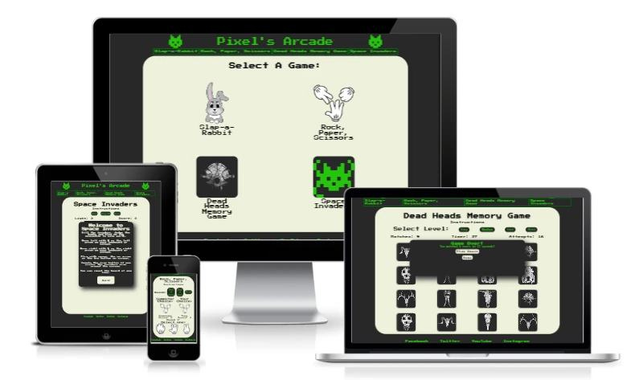

The live site can be found here: [Pixel's Arcade](https://sjecollins.github.ip/ci-pp2-pixels-arcade)

# Table of Contents

- [User Experience](https://github.com/SJECollins/ci-pp2-pixels-arcade#user-experience)
- [Features](https://github.com/SJECollins/ci-pp2-pixels-arcade#features)
  - [Universal](https://github.com/SJECollins/ci-pp2-pixels-arcade#universal)
  - [Index Page](https://github.com/SJECollins/ci-pp2-pixels-arcade#index-page)
  - [Slap-a-Rabbit](https://github.com/SJECollins/ci-pp2-pixels-arcade#slap-a-rabbit)
  - [Rock, Paper, Scissors](https://github.com/SJECollins/ci-pp2-pixels-arcade#rock-paper-scissors)
  - [Dead Heads Memory Game](https://github.com/SJECollins/ci-pp2-pixels-arcade#dead-heads-memory-game)
  - [Space Invaders](https://github.com/SJECollins/ci-pp2-pixels-arcade#space-invaders)
  - [Future Expansion](https://github.com/SJECollins/ci-pp2-pixels-arcade#future-expansion)
- [Design](https://github.com/SJECollins/ci-pp2-pixels-arcade#design)
- [Technologies Used](https://github.com/SJECollins/ci-pp2-pixels-arcade#technologies-used)
- [Testing](https://github.com/SJECollins/ci-pp2-pixels-arcade#testing)
- [Deployment](https://github.com/SJECollins/ci-pp2-pixels-arcade#deployment)
- [Credits](https://github.com/SJECollins/ci-pp2-pixels-arcade#credits)

# User Experience

## User Story
- As a user, I would like to easily browse for a game to play
- As a user, I would like to easily understand the game I am playing
- As a user, I would like to select the level of difficulty 
- As a user, I would like feedback on my progress in the game as I am playing
- As a user, I would like to know how I did when the game is finished
- As a user, I would like to be able to quickly reset the game whenever I choose

# Features

## Universal
### Header
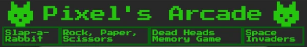

- The header element features across all pages. It includes the website title flanked by two icons with a navigation bar below.
- The title is a link which directs the user to the index page. When hovered over, the text transitions to a darker green indicating its interactivity.
- The navigation bar includes links to the game pages. Similarly to the header, on hover the text transitions to a darker green to provide feedback to the user when interacted with.

### Footer
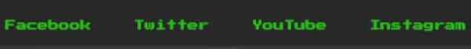

- The footer element features social media links and is found on all pages.
- The links have a similar transition to green as found in the header.

### Instructions

Instructions Example Image

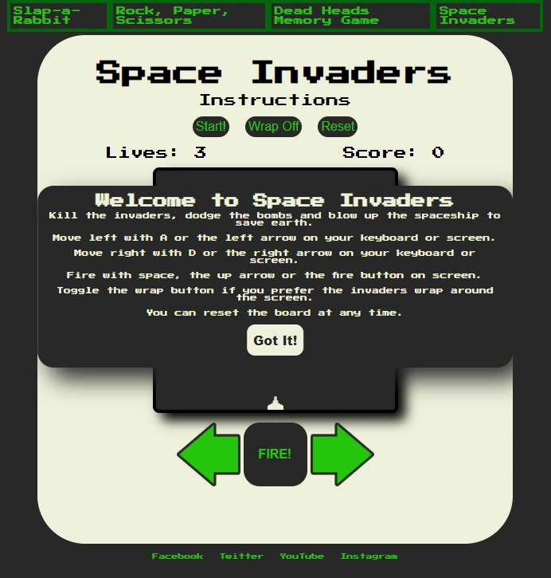

- Each game page features a instructions overlay.
- The instructions overlay can be displayed by clicking on the text "instructions" beneath the game's title. The interactivity is indicated by the cursor changing to a pointer and the text being underlined when hovered over.
- The overlay includes the game title, simple instructions and a link styled as a button to dismiss the overlay.
- The overlay is styled with white text on a black background. A box-shadow gives the illusion of the overlay floating over the game board. The "Got It!" link is styled as a button with black text on a white background that transitions to white text on a green background when hovered over to indicate to the user that they are about to interact with it.

### Game Over

Game Over Example Image

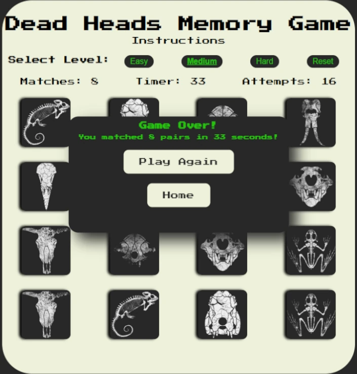

- Each game page features a Game Over overlay when the game ends.
- The overlay includes a heading announcing the end of the game, text informing the user of the result (whether they won or their points), and two links styled as buttons that allow the user to either play again or return to the index page.
- The overlay is styled with green text on a black background. Similarly to the instructions overlay, it features a box-shadow to give an illusion of it floating over the game. The links are styled similarly as well with the same transition from black on white to white on green when hovered over.

## Index Page

Index Page Image

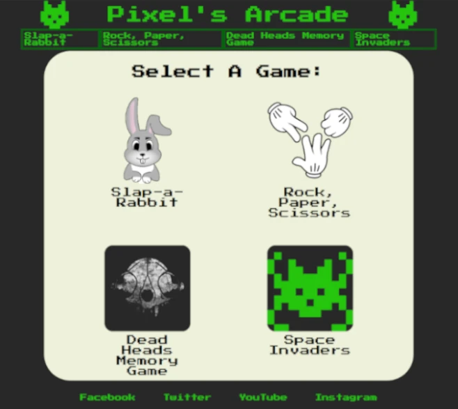

The index page acts as a simple menu for the games available on the website. A heading invites the user to select the game they would like to play from the selection below which contains a grid of images linking to the game pages, with their respective titles underneath.  

## Slap-a-Rabbit

Slap-a-Rabbit Image

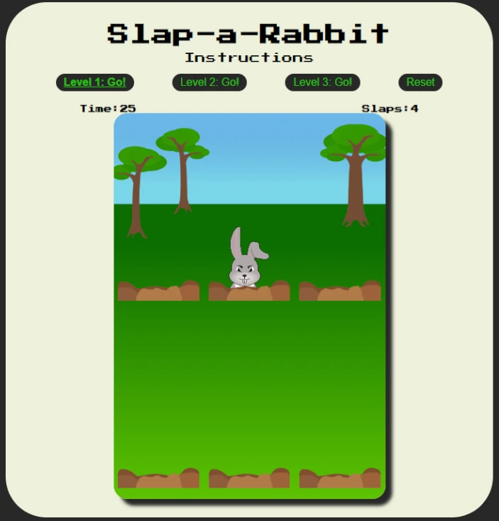

Slap-a-Rabbit is a a whack-a-mole style game. The title and presentation of the game are intended to make it as intuitive as possible on first interaction. Immediately on page load, the user is presented with the game title, the option to read instructions, buttons for level selection and game reset, and the empty game board itself with the default time and score displays.
- Instructions:
  - If the user hovers over the instructions text, their cursor changes to a pointer and the text becomes underlined to indicate they can click. This displays the instructions overlay which gives a brief introduction to the game and can be dismissed by clicking "Got It!"
- Buttons:
  - On selecting a level, the game begins, the timer starts and the rabbits pop up from the holes.
  - The level buttons are disabled during gameplay to prevent the user from triggering the startGame function in JS multiple times and breaking the game.
  - The selected level is underlined and font is bolded.
  - The reset button can be selected at any time and will reload the page.
- Gameplay:
  - On game start, the user is given 30 seconds to play the game, as explained in the instructions overlay.
  - The speed of the rabbits is determined by the level selected.
  - When a rabbit appears from a hole, the user can click or tap the rabbit which changes the image briefly to indicate interaction. The user is prevented from selecting the same rabbit multiple times.
  - Points are incremented and displayed each time a rabbit is "slapped."
  - At the end of 30 seconds, the Game Over overlay is displayed with the user's total "slaps" and the user can then decide if they would like to play again or return to the index page.

## Rock, Paper, Scissors

Rock, Paper, Scissors Image

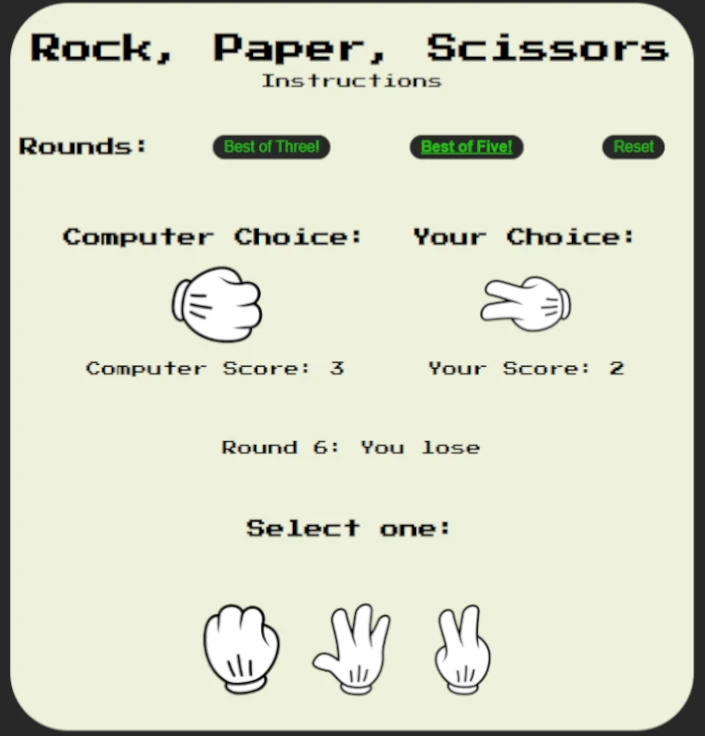

Rock, Paper, Scissors is a classic two-player game. Here the user can play against the computer in what is a essentially a random chance game. The game features instructions below the title, buttons to choose between best of three or five and to reset the board, displays for the computer's and user's choices, the scores, the round result, and the selectable options for the user at the bottom.
- Instructions:
  - If the user hovers over the instructions text, their cursor changes to a pointer and the text becomes underlined to indicate they can click. This displays the instructions overlay which gives a brief introduction to the game and can be dismissed by clicking "Got It!"
- Buttons:
  - The user has the option of playing best of three or best of five.
  - When selected, the button is underlined and font is bolded.
  - The level buttons are disabled during gameplay.
  - The reset button reloads the page at any stage.
- Gameplay:
  - The user starts each round by selecting from one of the options at the bottom of the screen.
  - With each selection, the displays are updated so that the choices of the user and computer are shown as images, the scores are incremented and displayed, and the round result is updated and displayed.
  - When either the user or computer reaches the required number of wins, the Game Over overlay is displayed and the result of "YOU WIN" or "YOU LOSE" is displayed depending on the outcome. The user can then decide if they would like to play again or return to the index page. 

## Dead Heads Memory Game

Dead Heads Memory Game Image

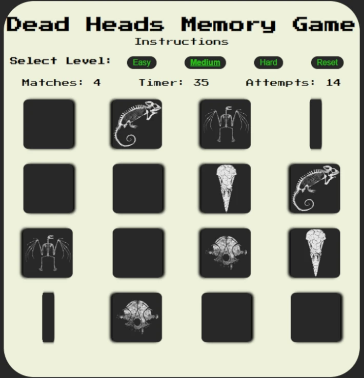

Dead Heads Memory Game is a classic card game where the user matches pairs while timed. It features instructions, buttons to select diffculty and reset the game, and displays for the time, correctly matched pairs and failed attempts.
- Instructions:
  - If the user hovers over the instructions text, their cursor changes to a pointer and the text becomes underlined to indicate they can click. This displays the instructions overlay which gives a brief introduction to the game and can be dismissed by clicking "Got It!"
- Buttons:
  - On selecting a difficulty, a board of six, eight or 10 pairs of cards is generated and displayed. 
  - The difficulty buttons are disabled during gameplay to prevent generating further cards.
  - The selected difficulty is bolded and underlined.
  - The reset button can be used at any time to reload the page.
- Gameplay:
  - On game start, the timer begins.
  - The user can flip two cards at a time only. If the cards match, they remain face up, the pairs tally is incremented, and the user can select a further two cards. If they do not match, the cards flip back over, the attemps tall is incremented, and the user can then select two more cards to flip.
  - Upon successfully matching all pairs on the board, the Game Over overlay appears with the number of pairs the user has matched and the time in which the user has done so. The user then has the option to play again or return to the index page.

## Space Invaders

Space Invaders Image

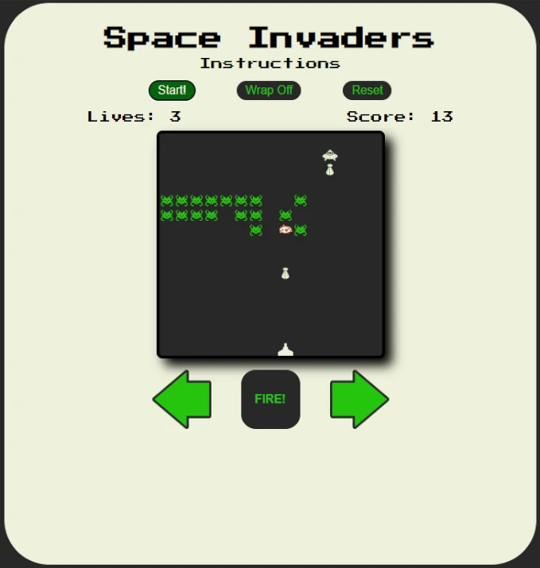

Space Invaders is a classic arcade game in which the user controlling a sprite at the bottom of the screen must shoot enemies before they reach the bottom of the screen. It features instructions, buttons to start the game, change the enemy wrap or reset the page, displays for lives and the score, and on-screen controls.
- Instructions:
  - If the user hovers over the instructions text, their cursor changes to a pointer and the text becomes underlined to indicate they can click. This displays the instructions overlay which gives a brief introduction to the game and can be dismissed by clicking "Got It!"
- Buttons:
  - The user can begin the game by selecting the start button.
  - The user can change how to enemies move across the page by clicking the wrap button.
  - The user can reset the page at any point with the reset button.
- Gameplay:
  - On game start, the invaders are generated and begin to move across the game board. After a set period of time, an enemy spaceship or "boss" appears which moves back and forth at the top of the screen and drops bombs which can damage the tank below.
  - Using either keyboard or on-screen controls, the user can move the tank left or right at the bottom of the screen and fire a missile at the enemies.
  - In line with the Rule of Three, the tank has each lives, which can be lost when hit with the bomb. And the boss must be hit three times to destory it.
  - When an invader is killed the score is incremented and when the tank is hit the lives display decreases by one.
  - The game can by won by destroying all the invaders and the boss. The game is lost when the invaders reach the bottom of the screen or the tank, or the tank loses all its lives.
  - When the game ends, the Game Over overlay is displayed telling the user if they lived or died and displays the number of invaders killed.

## 404 Page

404 Page Image

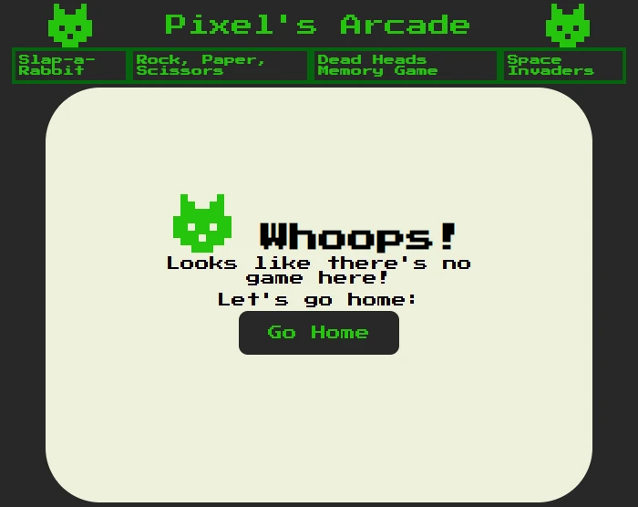

The 404 page is very simply styled. It features a link styled as a button that directs the user back to the home page.

## Future Expansion

# Design

The overall design is a retro aesthetic inspired by the Apple IIc. The games are generated on a "board" on each individual page and wrapped in this style to meld them together as a collection.

## Colour

There are three main colours featured across the website - green, black and off-white. These are based on the Apple IIc's green phosphorous display and it's casing.

## Typography

Google Fonts was used to import the Press Play 2P font to style.css. This is the only font used on the website as it is the only font available on Google Fonts that is reminiscent of the bitmap font used on on the Apple IIc.

## Buttons and Links

- Links are styled with a dark green transition to provide feedback to the user when hovered over.
- Level and reset buttons are styled with green text on black and transition to white on green when hovered over. When selected, the font-weight increases and green underline is applied to mark which level is active. 
- Overlay buttons are styled with black text on a white background to stand out on the black overlay. When hovered over, they transition to white text on a dark green background.
- Though not explicitly a link or button, the instructions text on each game is styled so a underline appears when hovered over to indicate to the user that it is interactive. 

## Wireframes

Wireframes were created in Balsamiq.

Index Page Wireframe

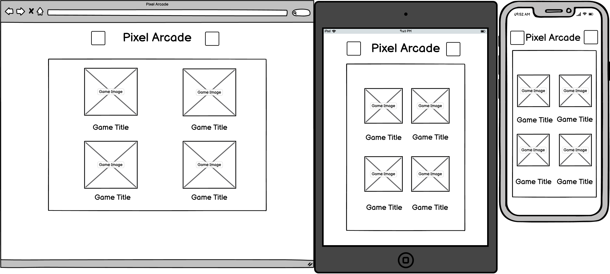

Game Screen Wireframe

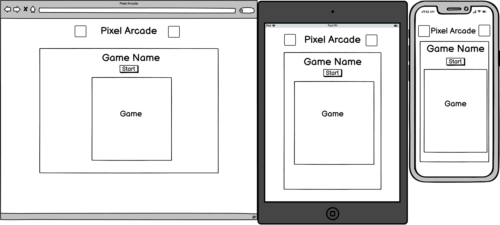

Game Over Wireframe

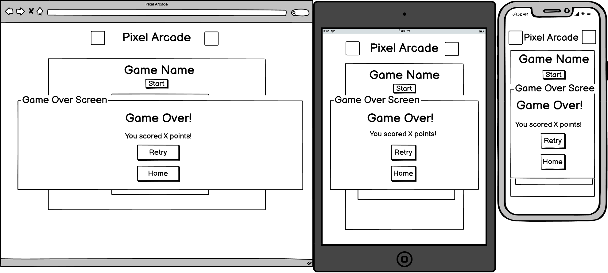

# Technologies Used

- [HTML5](https://en.wikipedia.org/wiki/HTML5): mark-up language.
- [CSS3](https://en.wikipedia.org/wiki/CSS): styling.
- [JavaScript](https://en.wikipedia.org/wiki/JavaScript): programming language.
- [GIT](https://git-scm.com): for version control.
- [GitHub](https://github.com): for host repository.
- [Gitpod](https://www.gitpod.io): online IDE.
- [Google Fonts](https://fonts.google.com): to import font.
- [Balsamiq](https://balsamiq.com): to create wireframes.
- [GIMP](https://www.gimp.org): to edit images for Rock, Paper, Scissors.
- [Inkscape](https://inkscape.org): to create images for Slap-a-Rabbit, and arrows for Space Invaders.
- [Aseprite](https://www.aseprite.org): to create the logo, and the sprites for Space Invaders

# Testing

## [HTML Validator](https://validator.w3.org/)
- Index:
  - 
  - [Link to HTML Validator](https://validator.w3.org/nu/?doc=https%3A%2F%2Fsjecollins.github.io%2Fci-pp2-pixels-arcade%2F)
- Slap-a-Rabbit:
  - 
  - [Link to HTML Validator](https://validator.w3.org/nu/?doc=https%3A%2F%2Fsjecollins.github.io%2Fci-pp2-pixels-arcade%2Frabbit.html)
- Rock, Paper, Scissors:
  - 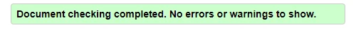
  - [Link to HTML Validator](https://validator.w3.org/nu/?doc=https%3A%2F%2Fsjecollins.github.io%2Fci-pp2-pixels-arcade%2Frps.html)
- Dead Heads Memory Game:
  - 
  - [Link to HTML Validator](https://validator.w3.org/nu/?doc=https%3A%2F%2Fsjecollins.github.io%2Fci-pp2-pixels-arcade%2Fcards.html)
- Space Invaders:
  - 
  - [Link to HTML Validator](https://validator.w3.org/nu/?doc=https%3A%2F%2Fsjecollins.github.io%2Fci-pp2-pixels-arcade%2Finvaders.html)

## [CSS Validator](https://jigsaw.w3.org/css-validator/)

    

- [Index results](https://jigsaw.w3.org/css-validator/validator?uri=https%3A%2F%2Fsjecollins.github.io%2Fci-pp2-pixels-arcade%2F&profile=css3svg&usermedium=all&warning=1&vextwarning=&lang=en)
- [Slap-a-Rabbit results](https://jigsaw.w3.org/css-validator/validator?uri=https%3A%2F%2Fsjecollins.github.io%2Fci-pp2-pixels-arcade%2Frabbit.html&profile=css3svg&usermedium=all&warning=1&vextwarning=&lang=en)
- [Rock, Paper, Scissors results](https://jigsaw.w3.org/css-validator/validator?uri=https%3A%2F%2Fsjecollins.github.io%2Fci-pp2-pixels-arcade%2Frps.html&profile=css3svg&usermedium=all&warning=1&vextwarning=&lang=en)
- [Dead Heads Memory Game results](https://jigsaw.w3.org/css-validator/validator?uri=https%3A%2F%2Fsjecollins.github.io%2Fci-pp2-pixels-arcade%2Fcards.html&profile=css3svg&usermedium=all&warning=1&vextwarning=&lang=en)
- [Space Invaders results](https://jigsaw.w3.org/css-validator/validator?uri=https%3A%2F%2Fsjecollins.github.io%2Fci-pp2-pixels-arcade%2Finvaders.html&profile=css3svg&usermedium=all&warning=1&vextwarning=&lang=en)

All pages passed CSS3 validation, however there were 8 warnings for cards.css related to vendor extensions.

## [JSHint](https://jshint.com/)

JSHint was used to detect errors in the JavaScript.
- All JavaScript files were flagged for missing semicolons, as expected.
- An unused variable was flagged in rabbit.js due to the reset button not being handled correctly in the DOM. This was corrected.
- No warnings were flagged in rps.js.
- One warning was flagged in cards.js:
  - "184	Expected an assignment or function call and instead saw an expression."
  - This occurred due to the ternary operator.
- One warning was flagged in invaders.js:
  - "129	Expected an assignment or function call and instead saw an expression."
  - This occurred due to the placement of bombInterval within the moveBoss function, however it does not prevent the code from running as intended.

## Lighthouse
The site was tested using Lighthouse in Chrome DevTools throughout the development to check performance, accessibiltiy, best practices and SEO. The final test on Lighthouse was run on incognito mode. The results are below.

Lighthouse Results

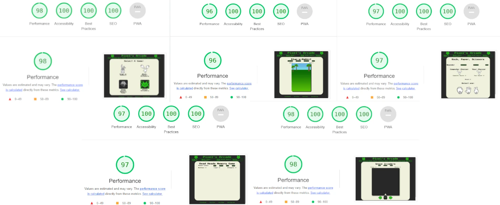

## Browser Compatibility
The website was tested on:
- Chrome Version 101.0.4951.67
- Firefox Version 101.0.4951.67
- Edge Version 101.0.1210.53
- Safari iOS Version 15.4.1

## Testing Functionality

## Testing User Story
- "As a user, I would like to easily browse for a game to play"
  - The main page acts as a list or library of the game content of the website. All games available are presented in a grid as the focus of the main page. Users can access any of the games on the site from this page.
  - The navigation bar in the header contains links to the games available on the site. This navigation bar is present across all pages so that users can easily jump between game pages when they choose.

- "As a user, I would like to easily understand the game I am playing"
  - All games present on the website are simple, classic games that are intuitive to play.
  - All game pages feature an instruction overlay that can be displayed when the user clicks on "Instructions" directly below the the game's title. The basics of the game are presented to user and they can reference this overlay whenever they wish.

- "As a user, I would like to select the level of difficulty"
  - Two of the games available on the website feature difficulty levels.
    - In Slap-a-Rabbit, the user can select between three levels with increasing gameplay speeds.
    - In Dead Heads Memory Game, the user can select between three levels which generate increasing numbers of pairs of cards to match.
  - Rock, Paper, Scissors allows the user to select the length of the game, however this does not really effect the "difficulty" of the game itself.
  - Currently, Space Invaders does not feature level difficulties.

- "As a user, I would like feedback on my progress in the game as I am playing"
  - In Slap-a-Rabbit, above the board there is a timer counting down for 30 seconds so that the user may monitor the length of time they have remaining. There is also a "slaps" counter that provides the user a running tally of the points as they play.
  - In Rock, Paper, Scissors, with each decision the user's and computer's choice image is updated, their score is incremented and the round result is updated to tell the user the result of each round.
  - In Dead Heads Memory Game, above the board there is a timer counting up from the beginning of the game, a score counter that updates with each successul pair match and an "attempts" counter telling the user how many times they failed to match a pair of cards.
  - In Space Invaders, there is a lives counter for the user that counts down each time a bomb hits the tank and a score counter that counts up each time an invader or the boss is killed.

- "As a user, I would like to know how I did when the game is finished"
  - Each game features a Game Over overlay which displays the user's final score and, in the case of Rock, Paper, Scissors or Space Invaders, whether the user won or lost.

- "As a user, I would like to be able to quickly reset the game whenever I choose"
  - All games feature a reset button in the UI. This simply reloads the the page.

# Deployment
## Steps to deploy site:
- In the GitHub repository, navigate to the "Settings" tab.
- Scroll down to "Pages" in the menu on the left hand side.
- Under the heading "Source", click the drop-down menu and select "main" branch.
- The page will automatically refresh with a link to the deployed website.
- It may not go live for a few minutes, refresh the page to update the link.
- Once deployed, the live website will automatically update when commits are made to the main branch.

The live site can be found here: [Pixel's Arcade](https://sjecollins.github.io/ci-pp2-pixels-arcade)

## Steps to clone site:
- In the GitHub repository, click the "Code" button.
- Select "HTTPS" and copy the URL.
- Open Git Bash and navigate to the repository where you would like to locate the cloned repository.
- Type "git clone" followed by the copied URL.
- Press enter to create the clone.

# Credits

## Code

- The code for Slap-a-Rabbit was adapted from:
  - [Frank's Laboratory](https://www.youtube.com/watch?v=RTb8icFiSfk&ab_channel=Frankslaboratory)
  - [Ania Kubow](https://www.youtube.com/watch?v=rJU3tHLgb_c&ab_channel=CodewithAniaKub%C3%B3w)
- The code for Rock, Paper, Scissors was adapted from:
  - [Web Dev Simplified](https://www.youtube.com/watch?v=1yS-JV4fWqY&ab_channel=WebDevSimplified)
  - [Ania Kubow](https://www.youtube.com/watch?v=RwFeg0cEZvQ&t=1s&ab_channel=CodewithAniaKub%C3%B3w)
- The code for Dead Heads Memory Game was adapted from:
  - [Marina Ferriera](https://marina-ferreira.github.io/tutorials/js/memory-game/)
  - [Tania Rascia](https://www.taniarascia.com/how-to-create-a-memory-game-super-mario-with-plain-javascript/)
- The code for Space Invaders was adapted from:
  - [Ania Kubow](https://www.youtube.com/watch?v=3Nz4Yp7Y_uA&ab_channel=CodewithAniaKub%C3%B3w)

## Media

- The images for Rock, Paper, Scissors are from this [free clipart image](https://www.clipartmax.com/middle/m2i8i8G6H7K9Z5H7_rock-paper-scissors-clipart-rock-paper-scissors-clip-art/)